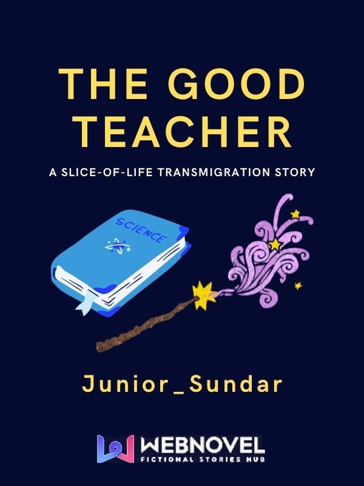

## Summary

Guy Larks was famous in his original world for his widespread charity work in poverty-stricken and war-torn nations.
He was especially known for his efforts in developing schools and educational facilities for children, as well as teaching and nurturing many students.

So it was devastating news to learn that he wouldn't live past his 30th year.

But he was given a second chance! A new life in another world, as a down-by-the-dumps teaching apprentice in a world of magic and wonder. He was given no cheat, just a Repository of Knowledge holding all the information he could bring with him from his previous life.

In this new world, Guy rediscovered his life's true calling! Ride along on Guy's journey as he changes the world one budding mind at a time, as the greatest teacher this world has ever seen!

**State of Story**:

* [[miscellaneous]]
* [[volume-1]] [COMPLETED][FREE]
* [[volume-2]] [COMPLETED][LOCKED]
* [[volume-3]] [COMPLETED][LOCKED]
* [[volume-4]] [COMPLETED][LOCKED]
* [[volume-5]] [ONGOING][LOCKED]

**Discord**:
https://discord.gg/PKbqtembQJ

**Expected Upload Frequency**: 
3 Chapters per Week 
w/ min. 1500 Words per Chapter

## Author's Note

This is a slice-of-life-ish story at its core. This is NOT a hot-blooded, high-octane novel filled with conflicts and fights around every corner. If that is the kind of story you are looking for, unfortunately, you will not find it here (at least not in the early chapters).

The MC is a modern man, with modern sensibilities. Conflicts are handled civilly, or avoided altogether. There will be fights, but the story does not revolve around it.

The MC is mature, and handles relationships tactfully. There will be a slow-burn romance in this story, and ABSOLUTELY NO HAREM. I despise that genre from the bottom of my heart!

I also have some LGBTQ+ elements planned for the future (with side characters).

English not first language. Writing mistake? Please forgive. Proofread many times before upload, problems not much. If issue, then point out mistake, I correct immediate. I am thank you for you're understanding :)

ALSO: I started writing this story with one intention in mind, and that was to act as a parody of existing novels with similar themes. However, around CH25, I realised that my work was becoming too derivative and boring. So I pivoted and decided to make my novel its own thing. I believe that my work has become better because of it.

**Additional Tags:** #NoHarem #LGBTQ+

____

> Word Count:
>
> Check out my Discord Server: https://discord.gg/PKbqtembQJ
> 
> Please VOTE WITH POWER STONES, REVIEW and ADD TO COLLECTIONS :)
