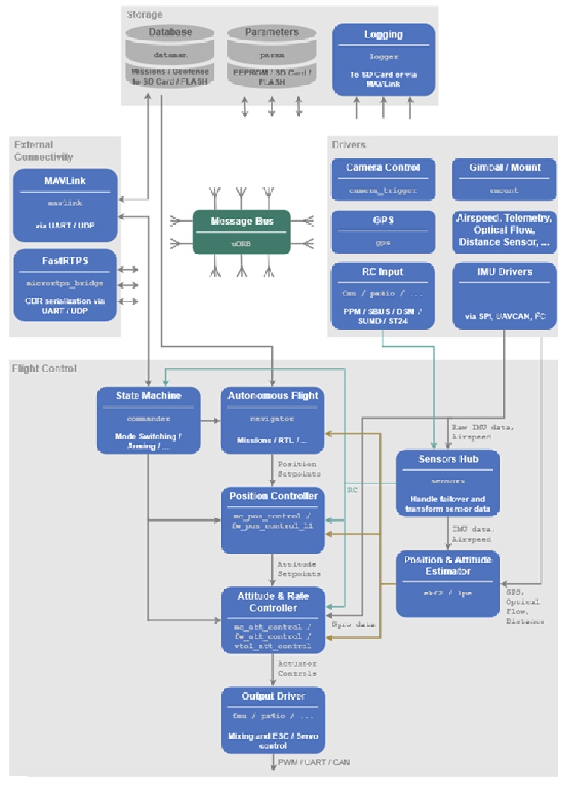
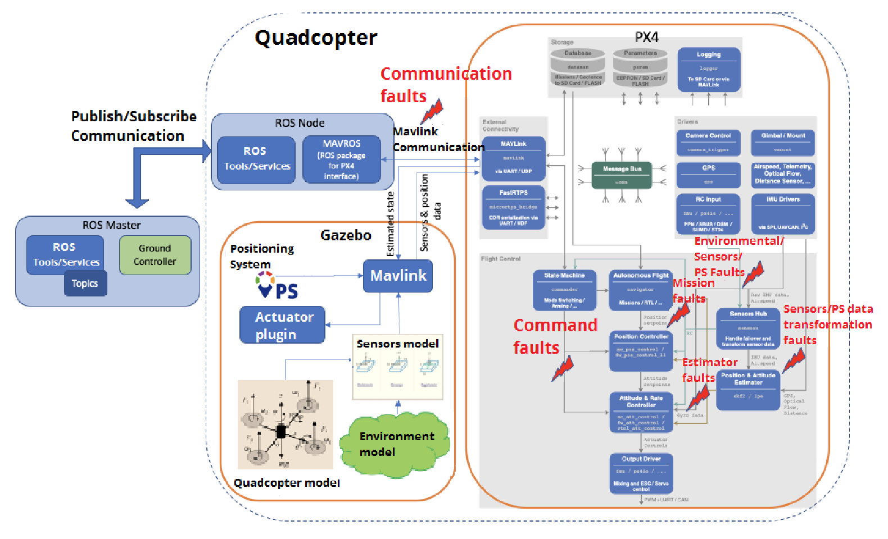

____
<!-- TOC -->
1. [Runtime Assurance of Aeronautical Products: Preliminary Recommendations](#runtime-assurance-of-aeronautical-products-preliminary-recommendations)
2. [Digital Twin for UAV Anomaly Detection](#digital-twin-for-uav-anomaly-detection)
3. [Fault Injector for Autonomous Quadrotors](#fault-injector-for-autonomous-quadrotors)
<!-- /TOC -->

____

# [Runtime Assurance of Aeronautical Products: Preliminary Recommendations](https://ntrs.nasa.gov/api/citations/20220015734/downloads/tm-rta-guidance.pdf)

## Introduction

Runtime assurance (RTA) affords an operational layer of protection against safety hazards to systems that may include less trusted or untrusted functions. To that end, the RTA scheme must itself be trusted before it can be deployed into use:
1. It must fit the intended purpose.
2. It must not itself introduce safety hazards.

## Definitions

- Runtime Monitoring (RTM) - observation of an executing system of interest, its functions, or its environment.
- Runtime Verification (RV) - specialisation of RTM, where response of monitor is result of an online verification procedure applied to monitor inputs.
- Runtime Assurance (RTM) - combinatin of RTM and one or more functions triggered by RTM, such as recovery, failover, warning, or shutdown.
- System Under Observation (SUO) - system of interest for RTA.
- Integrated System - SUO that includes RTA.

## Overview


RTA functions an be decomposed into the following implicitly runtime functions:

1. Input assurance - Ensures that not only do monitoring and backup functions receive trusted inputs, but also that they receive the right inputs.
2. Monitoring - Detects safety-related deviations/violations by observing an SUO
    - emergent interactions at system boundary,
    - violations or incorrect function inputs or assumptions of environmental conditions,
    - computational deviations from required internal states, state changes, and guards in state transitions, or undesired state transitions.
3. Switching decision logic - Risk mitigation intervention triggered by monitor to disconnect **complex function** and engage the **backup function**. Can be a simple or more sophisticated protocol.
4. Backup function - RTA includes one or more that serve to replace or failover from the primary complex function. Is generally a copy of primary with reduced service and capability but robust safety.

## Design

Trusted RTA is:

1. Simple
2. Benign
3. Realisable
4. Verifiable
5. Dependable


# [Digital Twin for UAV Anomaly Detection](https://www.duo.uio.no/bitstream/handle/10852/93934/1/DTAnomally.pdf)

The thesis explores the use of unmanned aerial vehicles (UAVs), emphasizing their rising popularity due to their low cost and simplicity compared to manned aircraft, particularly in dangerous or remote areas. It focuses on ensuring UAV safety and reliability in sensitive airspace by detecting sudden and anomalous behaviors. The study investigates the use of Inertial Measurement Units (IMU) and vibration analysis for monitoring UAV health.

A [[Digital Twin|technical.terminologies.digital-twin]] is employed to simulate physical system operations, generating data to identify normal UAV operation modes. Real-time operational data is compared against this to detect anomalies, using TimeGAN, a GAN variant for time series data, and k-Means clustering algorithm.

# [Fault Injector for Autonomous Quadrotors](https://estudogeral.uc.pt/bitstream/10316/95542/1/2021_Master_internship_Artur_Coutinho_Final_Report.pdf)

GitHub: [djtrak33/DFATool](https://github.com/djtrak33/DFATool)

## Introduction

The thesis includes a comprehensive literature review to establish a theoretical framework for improving UAV failure prediction, examining current UAV capabilities, sensor technology, and the application of digital twins in failure detection and predictive maintenance.

## Objectives

* defining and characterizing the quadcopter and its environment,

* identifying and characterizing failure scenarios, and

* creating a fault model encompassing generic and quadcopter-specific faults.

The end goal is to implement these faults using a tool that manages their presence in the code.

## Approach

While the original plan included a risk analysis of the faults, it was later discarded due to its perceived misalignment with the practical nature of the work. It is also noted that depending on the complexity of implementing exploits, it may not be possible to implement all identified faults. The project intends to perform experiments related to system assessment in an organized and efficient manner.

The research approach involves:

* identifying all components of an autonomous quadrotor,

* building a representative model,

* selecting appropriate simulation software, and

* creating a fault model.

The fault model is developed by analyzing software modules for potential exploitation. The document then describes the conceptualization of a fault injection tool using a web-based prototyping tool (Figma) and its subsequent implementation using Qt Creator.

The implementation phase involves working on both the tool's interface and the incorporation of specific faults, primarily focusing on GPS faults. The final step includes performing experiments to validate the implemented elements and analyzing the results to draw conclusions about the tool's effectiveness.

## Methodology

The flight-controller stack used is the PX4-Autopilot stack, and the simulation environment is Gazebo. This is preferred due to the light-weight and open-source nature of both. PX4’s robotics friendly middleware that facilitates communication with the flight-controller stack and companion systems was attractive. Gazebo’s wide array of sensor implementations were attractive for this.

The PX4’s internal firmware architecture is defined as in the following image. (NOTE: there are changes with the newest version of PX4 firmware as there is a shift towards the MicroXRCE-DDS firmware over the previous methodology).



The report defines 6 kinds of faults that can potentially injected into the system.

* Communication faults: faults that target the MAVLink communication channel between PX4’s MAVLink module and its respective ROS node.

* Command faults: faults that target commands issued by the State Machine module (e.g. abort command).

* Environmental/Sensors/PS faults: faults that target the data gathered by the sensors and corrupt it.

* Mission faults: faults that target the mission on cache whilst it is being read, possibly affecting trajectory.

* Sensors/PS data transformation faults: faults that target the data gathered by the sensors whilst it is being processed.

* Estimator faults: faults that target the processed data once it is sent to the modules that control the drone’s movement.

These faults can potentially be implemented as follows:



Although the report lists a range of methods to implement faults, it limits its work to the GPS module in order to map and observe the behaviour before, during and after fault injection. The test cases were for Freeze, Delay and Fixed type faults. This is implemented in the [code](https://github.com/djtrak33/DFATool/blob/fd51eebafb72f4ae162e89de62ebeef0c3e4386d/PX4-Autopilot/src/modules/sensors/vehicle_gps_position/VehicleGPSPosition.cpp) (from Line 885) as follows:

```cpp
if(fault_mode == 1 && !std::isnan(start_injection_time) && !std::isnan(end_injection_time) && (gps.timestamp - takeoff_start_timestamp >= start_injection_time) && (gps.timestamp - takeoff_start_timestamp <= end_injection_time)){
        //Fixed Value
        PX4_INFO("injecting gps fixed value");
        if(!std::isnan(injected_gps_lat))  gps_output.lat = (int32_t) injected_gps_lat; else gps_output.lat = gps.lat;
        if(!std::isnan(injected_gps_lon))  gps_output.lon = (int32_t) injected_gps_lon; else gps_output.lon = gps.lon;
        if(!std::isnan(injected_gps_alt))  gps_output.alt = (int32_t) injected_gps_alt; else gps_output.alt = gps.alt;
    }else if(fault_mode == 2 && !std::isnan(start_injection_time) && !std::isnan(end_injection_time) && (gps.timestamp - takeoff_start_timestamp >= start_injection_time) && (gps.timestamp - takeoff_start_timestamp <= end_injection_time)){
        //Freeze Value
        PX4_INFO("injecting gps freeze value");
        injected_gps_lat = gps.lat;
        injected_gps_lon = gps.lon;
        injected_gps_alt = gps.alt;
        gps_output.lat = injected_gps_lat;
        gps_output.lon = injected_gps_lon;
        gps_output.alt = injected_gps_alt;
        hasFreezeValue = true;
    }else if(fault_mode == 3 && !std::isnan(start_injection_time) && !std::isnan(end_injection_time) && (gps.timestamp - takeoff_start_timestamp >= start_injection_time) && (gps.timestamp - takeoff_start_timestamp <= end_injection_time)){
        //Delay Value
        //Wait for delay_value seconds
        PX4_INFO("injecting gps delay value");
        gps_output.lat = gps.lat;
        gps_output.lon = gps.lon;
        gps_output.alt = gps.alt;
        std::this_thread::sleep_for(std::chrono::seconds((int)delay_value));
    }
    else{
        gps_output.lat = gps.lat;
        gps_output.lon = gps.lon;
        gps_output.alt = gps.alt;
    }
```
The second half of the report defines a prototype UI that can be used to inject the faults into the system. 

PX4 contains various failsafes that allow it to detect anomalies internally and abort flights that exhibit said anomalies. In this experiment, the failsafe activation delays were set to minimum.
Conclusion

First off, although the failsafe delay was set, any sudden changes in values was met with an immediate abort command.

The report concludes that the initial objectives were met, with the behaviour of simlated drone under fault matching expected hypotheses. However, there is still room for improvement as not all faults were implemented.

## Evaluation

This report, while extensive in its set-up, falls during the implementation stages significantly. The testing is insufficient to conclude that the objectives are met. It is suspected that a time-crunch or resource-crunch resulted in this level of output. Nonetheless, even with this shortcoming, it offers a pathway to feasibly inject faults into the UAV system for testing sRTA use cases.

First off, the injection of fault for GPS is hardcoded into the firmware, requiring recompilation everything a new type of fault is expected to be injected. To fix this, relying on the internal system parameter server is considered. Changing the values in the server for params corresponding to fault types can make the fault testing more dynamic in nature.

Secondly, we can refer to the listed fault classes and expand it by also adding a category called Use Case class that refers to the type of use case a potential fault can fall under. A rough example list could be: Security Attack, Sensor Failure, Controller Failure, Software Failure, etc. 

This can then be put in tabular form like this:

| Fault Title                                                                                             | Fault Class                           | Use Case Class                                     |
|---------------------------------------------------------------------------------------------------------|---------------------------------------|----------------------------------------------------|
| Target and alter data retrieved from sensors                                                            | Environmental/Sensors/PS faults       | Security Attack/Sensor Failure                     |
| Alter published flight control output signal values                                                     | Sensors/PS data transformation faults | Software Failure/Controller Failure                |
| Intercept and alter mission commands and mission signals                                                | Mission faults                        | Security Attack                                    |
| Target middleware that facilitates communication between controller-processor/drone-drone/drone-GC etc. | Communication faults                  | Security Attack/Software Failure                   |
| Target and alter calibration of the internal controller                                                 | Estimator faults                      | Controller Failure/Software Failure                |
| Confound the internal state machine that maintains transition between flight modes and states           | Command faults                        | Software Failure/Controller Failure/Sensor Failure |


Finally, observe that most, if not all, of the faults in the thesis are targeting the flight control modules within the firmware instead of the environmental models, sensors models, or quadcopter models in the simulated environment. This has its advantage as the firmware is simulator independent and can be run on different simulator types. However, this also means that HITL testing with the firmware can get sketchy as additional memory and internal clock interruptions are potentially being introduced that will affect the hardware's runtime behaviour. 