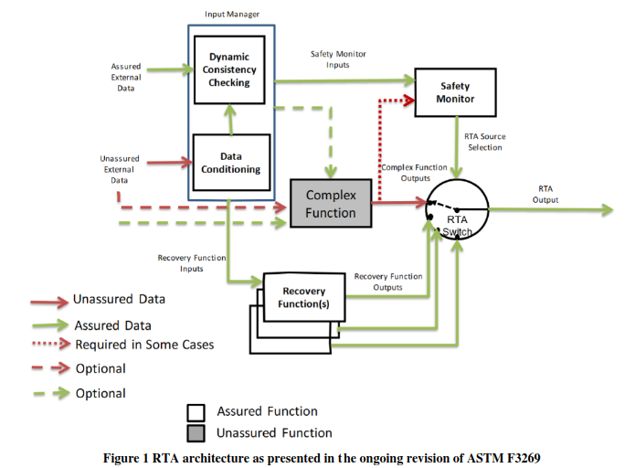

# [Runtime Assurance of Aeronautical Products: Preliminary Recommendations](https://ntrs.nasa.gov/api/citations/20220015734/downloads/tm-rta-guidance.pdf)

## Introduction

Runtime assurance (RTA) affords an operational layer of protection against safety hazards to systems that may include less trusted or untrusted functions. To that end, the RTA scheme must itself be trusted before it can be deployed into use:
1. It must fit the intended purpose.
2. It must not itself introduce safety hazards.

## Definitions

- Runtime Monitoring (RTM) - observation of an executing system of interest, its functions, or its environment.
- Runtime Verification (RV) - specialisation of RTM, where response of monitor is result of an online verification procedure applied to monitor inputs.
- Runtime Assurance (RTM) - combinatin of RTM and one or more functions triggered by RTM, such as recovery, failover, warning, or shutdown.
- System Under Observation (SUO) - system of interest for RTA.
- Integrated System - SUO that includes RTA.

## Overview

RTA functions an be decomposed into the following implicitly runtime functions:

1. Input assurance - Ensures that not only do monitoring and backup functions receive trusted inputs, but also that they receive the right inputs.
2. Monitoring - Detects safety-related deviations/violations by observing an SUO
    - emergent interactions at system boundary,
    - violations or incorrect function inputs or assumptions of environmental conditions,
    - computational deviations from required internal states, state changes, and guards in state transitions, or undesired state transitions.
3. Switching decision logic - Risk mitigation intervention triggered by monitor to disconnect **complex function** and engage the **backup function**. Can be a simple or more sophisticated protocol.
4. Backup function - RTA includes one or more that serve to replace or failover from the primary complex function. Is generally a copy of primary with reduced service and capability but robust safety.

## Design

Trusted RTA is:

1. Simple
2. Benign
3. Realisable
4. Verifiable
5. Dependable

# [Digital Twin for UAV Anomaly Detection](https://www.duo.uio.no/bitstream/handle/10852/93934/1/DTAnomally.pdf)

The thesis explores the use of unmanned aerial vehicles (UAVs), emphasizing their rising popularity due to their low cost and simplicity compared to manned aircraft, particularly in dangerous or remote areas. It focuses on ensuring UAV safety and reliability in sensitive airspace by detecting sudden and anomalous behaviors. The study investigates the use of Inertial Measurement Units (IMU) and vibration analysis for monitoring UAV health.

A [[Digital Twin|technical.terminologies.digital-twin]] is employed to simulate physical system operations, generating data to identify normal UAV operation modes. Real-time operational data is compared against this to detect anomalies, using TimeGAN, a GAN variant for time series data, and k-Means clustering algorithm.

The thesis includes a comprehensive literature review to establish a theoretical framework for improving UAV failure prediction, examining current UAV capabilities, sensor technology, and the application of digital twins in failure detection and predictive maintenance.