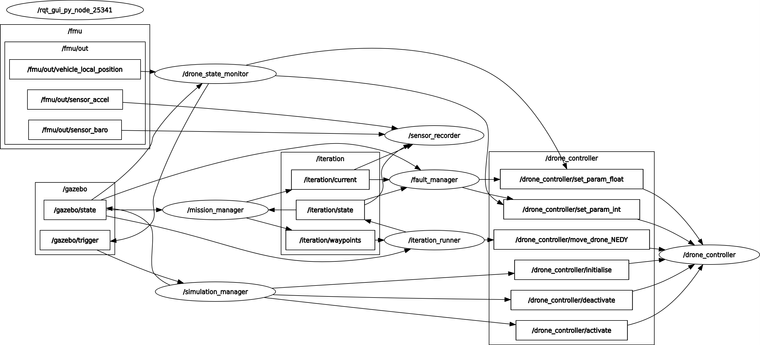
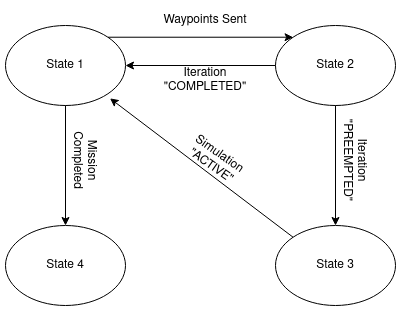

___
<!-- TOC -->
1. [Introduction](#introduction)
    - [Concept](#concept)
    - [Summary](#summary)
2. [Implementation](#implementation)
    - [Flight Controller](#flight-controller)
    - [Simulation and Mission Management](#simulation-and-mission-management)
3. [Execution](#execution)
    - [Installation](#installation)
    - [Launch](#launch)
    - [ROS 2 and MAVSDK](#ros-2-and-mavsdk)
    - [Architecture](#architecture)
    - [Configuration](#configuration)
    - [Nodes](#nodes)
    - [Data Collection](#data-collection)
    
<!-- /TOC -->
___

# Introduction

## Concept

![[Concept from literature review | ideas.srta-exploration.literature-review#introduction-1]]

## Summary

It is theorised and tested that by embedding the faults directly into the flight controller modules, it is possible to simulate, in real-time, the cases where the drone is experiencing different types of failure modes.

# Implementation

## Flight Controller

GitHub: [juniorsundar-tii/PX4-Autopilot](https://github.com/juniorsundar-tii/PX4-Autopilot)

The system under fault is the Pixhawk controller running a modified PX4-Autopilot code. The code is a fork of the untampered PX4-Autopilot source code. The changes are implemented in the `/src/modules/sensors` directory to the IMU, Magnetometer, and Barometer (with possibility to add more features).

New system parameters are introduced in `/src/modules/sensors/sensor_params.c` file that can be edited through Mavlink protocol or through QGroundControl. General form of these params are:

- SENS\_{SENSOR_ABBR}\_FAULT - INT (1 or 0) - Activates fault injection to sensor module.

- SENS\_{SENSOR_ABBR}\_NOISE - FLOAT - Activates Gaussian noise fault with given standard deviation.

- SENS\_{SENSOR_ABBR}\_SHIF - FLOAT - Activates sensor shift of constant value based on percent provided of original value (as decimal).

- SENS\_{SENSOR_ABBR}\_SCAL - FLOAT - Activates sensor scaling based on factor provided.

- SENS\_{SENSOR_ABBR}\_DRIFT - FLOAT - Activates sensor drifting based on constant value provided that grows linearly with time.

## Simulation and Mission Management

For the purpose of training ML models, a large influx of data is required. The data can only be generated with the drone running in both faulty and fault-free scenarios. Repeatability and safety are a concern, hence a simulated environment is the go-to strategy. The drone in simulation will experience faults, and the required data streams will be recorded.

We will use Mission and Iteration repeatedly, hence a formal definition is provided.

> **Iteration** - A single run of the drone with a given list of waypoints that are in NEDY coordinate frame.
>
> **Mission** - A collection of iterations.

Prior to the start of a mission, the user will specify the nature and extent of faults to be injected. This will be in the form of a .yaml file where the parameters can be set manually. Then, the mission is generated, which is basically a list of list of waypoints, i.e. a list of iterations.

The iterations will be executed sequentially, and during execution the predefined sensors that are being listened to will be recorded. During the iteration, it is possible to activate and deactivate faults at random intervals (which can also be set in the mission parameters .yaml file).

If the drone fails catastrophically during iteration execution, the iteration will be preempted, and the mission continues to the next iteration in the sequence.

At preemption or completion of an iteration, the recorded data streams are dumped as .csv files. The time and type of fault injected will also be dumped as .csv files. Additionally, if the iteration was preempted due to catastrophic failure, this is also labelled in the .csv file.

At catastrophic failure, the mission is paused while the simulation reloads.

# Execution

GitHub: [tiiuae/px4-fault-ws](https://github.com/tiiuae/px4-fault-ws/)

## Installation

A shell script included in the aforementioned repository handles all the installation and building. All you need to do is run the following code:

```bash
mkdir -p ~/px4_fault_ws
git clone --recursive https://github.com/tiiuae/px4-fault-ws.git ~/px4_fault_ws
cd ~/px4_fault_ws/
chmod +x ./scripts/*.sh
./scripts/build.sh
```

**Note**: This shell script also installs and builds the faulty PX4-Autopilot firmware from [[this section | technical.frameworks.px4.simulation.use-case-sensor-fault-injection-simulation#flight-controller]]. So it is best if you don't install and build the flight controller separately.


## Launch

To run the simulation, simply call the executable shell scripts:

```bash
./scripts/launch_sim.sh
```

If you want to update the platform if there are changes upstream, simply run the script:

```bash
./scripts/update.sh
```

## ROS 2 and MAVSDK

The ROS 2 framework was chosen to build this simulation platform due to the fact that the data collection is to be done directly through the ROS 2 topics that are exposed via the MicroXRCEAgent (the DDS agent) running on the companion processor. Furthermore, it is taken that it will also make it easier to extend the implementation into the final product.

We are also using [[MAVSDK with Python wrappings|technical.libraries.mavsdk.python]] in order to control the drone and also publish parameters to the drone’s parameter server. This is the method through which the faults are injected into the system.

## Architecture




```bash
# Project structure
px4_fault_ws/
├─ .gitignore
├─ README.md
├─ px4_fault_injection/
│  ├─ CMakeLists.txt
│  ├─ config/
│  │  ├─ circuit_params.yaml
│  │  ├─ fault_label_descriptors.yaml
│  │  ├─ metadata.yaml
│  ├─ package.xml
│  ├─ px4_fault_injection/
│  │  └─ __init__.py
│  └─ scripts/
│     ├─ data_merger.py
│     ├─ drone_controller.py
│     ├─ drone_state_monitor.py
│     ├─ fault_manager.py
│     ├─ iteration_runner.py
│     ├─ mission_manager.py
│     ├─ sensor_recorder_unsync.py
│     └─ simulation_manager.py
└─ scripts/
   ├─ build.sh
   ├─ configure.py
   ├─ create_session.sh
   ├─ kill_session.sh
   ├─ launch_sim.sh
   └─ update.sh
```

### Configuration

The platform consists of five principle configuration files that must be taken into consideration:

- `circuit_params.yaml`
- `fault_label_descriptors.yaml`
- `metadata.yaml`
- **`configure.py`**

#### circuit_params.yaml

Describes the parameters for the mission. In this, you define:

- mission boundaries
- number of waypoints per iteration
- number of iterations
- fault begin time/duration/off-time
- sensors:
    * recorded
    * faulted
    * type and nature of faults

This file is accessed by a lot of nodes in the simulation platform. However it doesn't have to be edited manually as a simpler configuration methodology is provided.

#### fault_label_descriptors.yaml

Describes the faults injected into the sensors (as defined in [[this section | technical.frameworks.px4.simulation.use-case-sensor-fault-injection-simulation#flight-controller]]).

Does not have to be edited unless you want to change the way in which the faults are labelled in merged file.

#### metadata.yaml

Expounds on the variables in the data structures (ros2 and uORB messages) being transported in topics. This is so that any users downstream can better understand the type and nature of data for training.

This file does not have to be edited unless you want to change the data labels in the merging step at the end of each iteration.

#### configure.py

Run:

```bash
python3 configure.py --help
```

You can set the mission configuration prior to launching the simulation. By default, all faults are switched off and all sensors are activated.

### Nodes

The platform consists of seven nodes:

- `simulation_manager.py`
- `drone_state_monitory.py`
- `mission_manager.py`
- `iteration_runner.py`
- `fault_manager.py`
- `sensor_recorder.py`
- `drone_controller.py`

These nodes are shown in image above as ovals. The arrows indicate what topics (rectangular boxes) the nodes subscribe (arrow towards) or publish to (arrow away from).

#### drone_controller.py

The drone is controlled through MAVSDK’s builtin functions. However, it is only possible in Python through asynchronous functions calls. This interferes with the normal running sequence of nodes hence a separate node was built that is meant to purely handle the control of the drone. This node subscribes to five topics that all fall under the `/drone_controller` namespace.

The `/drone_controller` topic namespace contains six subtopics:

- `/initialise` receives an `std_msgs/Empty` message and initialises connection with the drone.
- `/activate` receives an `std_msgs/Empty` message and arms and activates offboard mode with the drone.
- `/deactivate` receives an `std_msgs/Empty` message and deactivates and disarms the drone.
- `/move_drone_NEDY` receives an `std_msgs/Float32MultiArray` message of size four (4) which is the NEDY target coordinates, and moves the drone to that coordinate.
- `/set_param_int` receives an `std_msgs/String` message of format 'PARAM_NAME/<PARAM_VALUE>' and updates the PARAM_VALUE of PARAM_NAME in parameter server. Note that PARAM_VALUE can only be an integer.
- `/set_param_float` receives an `std_msgs/String` message of format 'PARAM_NAME/<PARAM_VALUE>' and updates the PARAM_VALUE of PARAM_NAME in parameter server. Note that PARAM_VALUE can only be a float.

#### simulation_manager.py

Since the simulation platform being used is Gazebo (Ignition), some difficulty was faced in closing it cleanly at time of drone catastrophic failure, as the Gazebo server was still persisting at termination of the shell command. This node’s purpose is to basically run two shell scripts:

```bash
# START SIMULATION
SESSION_NAME="px4_sim"

# Create a new detached tmux session
tmux new-session -d -s $SESSION_NAME

# Run your commands in the tmux session
tmux send-keys -t $SESSION_NAME 'cd /path/to/faulty-PX4-Autopilot' C-m
tmux send-keys -t $SESSION_NAME "make px4_sitl gz_x500" C-m
# tmux send-keys -t $SESSION_NAME 'HEADLESS=1 make px4_sitl gz_x500' C-m
echo "tmux session $SESSION_NAME started"
```

```bash
# KILL SIMULATION
SESSION_NAME="px4_sim"

killall -9 px4
killall -9 ninja
killall -9 make
killall -9 java

# Replace 'process_name' with the name of the process you want to kill
PROCESS_NAME="gz sim"

# Find the process ID
PID=$(ps aux | grep "$PROCESS_NAME" | grep -v grep | awk '{print $2}')

# Check if the PID was found
if [ -z "$PID" ]; then
    echo "No process found with name $PROCESS_NAME"
else
    # Kill the process
    kill $PID
    echo "Process $PROCESS_NAME (PID $PID) has been killed."
fi

# Kill the tmux session
tmux kill-session -t $SESSION_NAME

echo "tmux session $SESSION_NAME killed"
```

This node subscribes to:

- `/gazebo/trigger` receives an `std_msgs/String` message that is either: “KILL“, “START“, or “KILL_RE“ depending on whether the simulation needs to be killed, started or restarted respectively.

This node publishes to:

- `/gazebo/state` publishes an `std_msgs/String` message that is either: “KILLED“, “IDLE“ or “ACTIVE“ depending on simulation and drone state. “IDLE“ is simulation on with drone connection inactive, while “ACTIVE” is simulation on with drone fully controllable.
- `/drone_controller`:
  - `/initialise`
  - `/activate`
  - `/deactivate`

#### drone_state_monitor.py

This node subscribes to:

- `/gazebo/state`: Waits to see if simulation is ACTIVE or not.
- `/fmu/out/vehicle_local_position`: Observes the drone’s kinematic parameters (position, velocity and acceleration). It is assumed that if drone is out of the prescribed bounds, and if its velocity and acceleration values are beyond normal, it is experiencing catastrophic failure. This was decided because no other real-time parameter or telemetry data could be found that identified the simulated drone’s state reliably. In Python, the condition for failure are:

```python
# Check position and velocity limits
pos_limits = self.mission_params['boundaries']
pos_cond1 = msg.x > pos_limits['east_west']['upper'] or msg.y > pos_limits['north_south']['upper'] or msg.z < pos_limits['altitude']['upper']
pos_cond2 = msg.x < pos_limits['east_west']['lower'] or msg.y < pos_limits['north_south']['lower']
vel_cond = abs(msg.vx) > 200 or abs(msg.vy) > 200 or abs(msg.vz) > 200
acc_cond = abs(msg.ax) > 200 or abs(msg.ay) > 200 or abs(msg.az) > 200
```

This node publishes to:

- `/drone_controller` If there is catastrophic failure, we need to set all the aberrant failure modes to zero so that upon restart, the drone can function normally.
  - `/set_param_int`
  - `/set_param_float`
- `/gazebo/trigger` After the parameters are normalised, trigger a KILL_RE for the simulation.

#### mission_manager.py

This node first takes a `circuit_params.yaml` file that contains the parameters for the mission. This is used to generate all waypoints for iterations.

This node subscribes to:

* `/gazebo/state`: observes the simulation state.

* `/iteration/state`: receives a `std_msgs/String` message that is: “STARTED“, “PREEMPTED“ or “COMPLETED“ depending on the state of current iteration.

This node publishes to:

* `/iteration`:

    * `/current`: carries a `std_msgs/Int8` message that indicates the current iteration number.

    * `/waypoints`: carries a `std_msgs/Float32MultiArray` that is a 1D list of length 4 times the number of waypoints in current iteration.

The mission sequence is managed through a state machine with four states. The transitions between states is based off of the inputs received from the two `/state` topics.



#### fault_manager.py

This node subscribes to:

* `/iteration`
    * `/current`: When a new iteration is started, a new thread is initialised that will basically activate the defined faults in `circuit_params.yaml` randomly. The time of start, and type and nature of faults is recorded in a .csv file. The thread is exited when iteration is COMPLETED or PREEMPTED.
    * `/state`: When the iteration is COMPLETED, the .csv file is dumped and all the faults are deactivated.
* `/gazebo/state`: Waits to see if simulation moves from ACTIVE to IDLE or KILLED. In that case, the current iteration is PREEMPTED. If the simulation is KILLED while still in iteration, the data collection is preempted and dumped.

This node publishes to:

* `/drone_controller`: Set the params for faults randomly
    * `/set_param_int`
    * `/set_param_int`

#### sensor_recorder.py

This node’s only purpose is to subscribe to the telemetry ros2 topics from the drone controller and dump it into .csv file after the completion of each iteration.

### Data Collection

Recorded data is dumped into the `/records` folder amongst the `/build` and `/install` folders. Each mission is labelled by timestamp, with subdirectories corresponding to the iteration number.